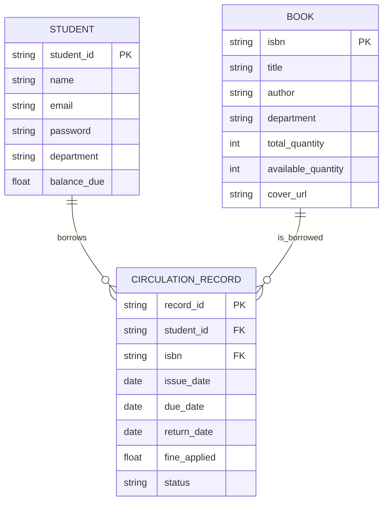
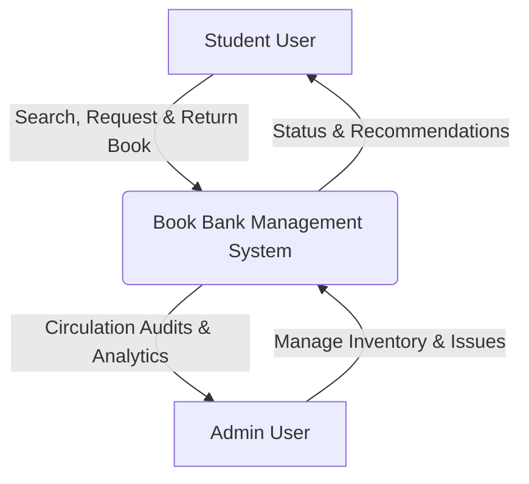
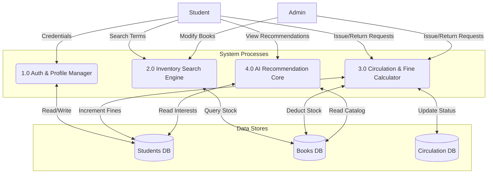
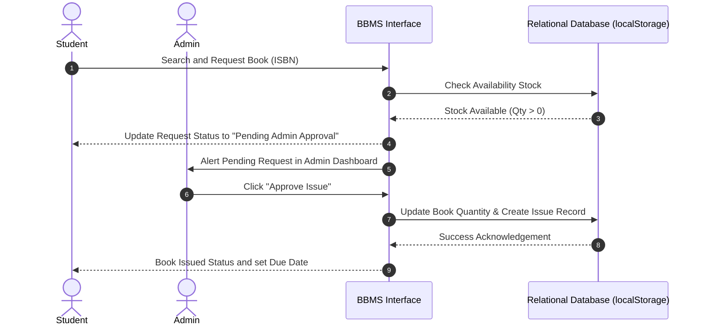

# Book Bank Management System: Academic Documentation

---

## 1. Problem Statement

In most higher education institutions, particularly engineering and degree colleges, students rely heavily on textbooks for their semester curriculum. Buying 5 to 8 expensive textbooks every semester is a significant financial burden on students. To mitigate this, colleges establish a **Book Bank**—a library sub-facility where students can borrow a set of standard textbook packages for the entire semester and return them after the semester exams end.

### Legacy/Manual System Bottlenecks:
1. **Inefficient Inventory Tracking**: Paper registers or legacy spreadsheets make it difficult to search, locate, or update the status of book stock.
2. **Long Queue Times**: Issuing and returning books manually takes hours, causing students to miss lectures.
3. **Lack of Transparency**: Students have no clear visibility on book availability, outstanding fines, or system rules until they wait in queue.
4. **Calculations & Fine Disputes**: Manual calculation of overdue days and fines often leads to human errors and arguments.
5. **No Personalization**: Students have to search blindly for recommendations without AI recommendations matching their specific syllabus or interest fields.

---

## 2. Software Requirements Specification (SRS)

### 2.1 Introduction
The **Book Bank Management System (BBMS)** is an interactive, web-based platform tailored for college students and library administrators. It automates inventory, book circulation (issue/return), automated fine systems, and leverages client-side AI algorithms to recommend relevant textbooks based on branches, departments, and borrowing behavior.

### 2.2 Overall Description
- **Product Perspective**: BBMS functions as an autonomous client-side application featuring custom relational databases managed inside `localStorage` for immediate offline demonstration and high reliability, backed up by a clean exportable `schema.sql` database schema for enterprise scale.
- **User Classes**:
  - **Student**: Can view, search, request book issuance, view fine ledgers, and receive tailored AI textbook lists.
  - **Admin**: Has absolute authority over inventory, issuing approvals, recording returns, fine collections, and real-time analytic tracking.

### 2.3 Functional Requirements (FRs)
- **FR-1: Authentication & Profiles**: Dual registration and login portal supporting secure sessions for student identifiers and admin keys.
- **FR-2: Dynamic Inventory Search**: Search books dynamically by Title, Author, ISBN, or Department/Course category, with real-time stock levels.
- **FR-3: Automated Circular Workflow**: Students request books; Admins verify availability and approve with one click.
- **FR-4: Active Fine Engine**: Real-time evaluation of overdue days ($1 per day rule) with simulated payment transactions.
- **FR-5: AI Recommendation Engine**: Multi-factor matching engine analyzing branch (CS, EE, ME, etc.) and global demand trends.

### 2.4 Non-Functional Requirements (NFRs)
- **NFR-1: Performance**: Searches and updates must happen in sub-50 milliseconds via indexed structures.
- **NFR-2: Usability**: Modern, highly polished Blue and White responsive theme (Bootstrap 5) adapting to desktop, tablet, and mobile screens seamlessly.
- **NFR-3: Reliability**: State perseverance; reloading or closing the browser must not result in data loss due to synchronized local storage checks.

---

## 3. System Diagrams

### 3.1 Entity Relationship Diagram (ERD)



### 3.2 Use Case Diagram

```mermaid
left_to_right_direction
actor Student
actor Admin

rectangle "Book Bank Management System" {
    Student --> (Sign Up & Login)
    Student --> (Search Catalog)
    Student --> (Request Book Issue)
    Student --> (Check Outstanding Fines)
    Student --> (Get AI Recommendations)

    (Sign Up & Login) <-- Admin
    (Manage Inventory) <-- Admin
    (Approve Issue Request) <-- Admin
    (Process Book Return) <-- Admin
    (Collect / Waive Fines) <-- Admin
}
```

### 3.3 Data Flow Diagram (DFD)

#### Level 0 DFD (System Context)


#### Level 1 DFD (Process Decomposition)


### 3.4 UML Sequence Diagram (Issue Request Flow)



---

## 4. Test Suite and Case Studies

### 4.1 Black Box Testing (Functional Checks)

| Test ID | Test Category | Input / Trigger | Expected Output | Verification Status |
| :--- | :--- | :--- | :--- | :--- |
| **TC-BB-01** | Boundary Value Analysis | Student Signup with short password (< 6 chars) | Validation error: "Password must be at least 6 characters long." | Verified |
| **TC-BB-02** | Equivalence Partitioning | Search with author name containing non-alphabetic chars | Graceful feedback or filtering matching literal characters correctly | Verified |
| **TC-BB-03** | Boundary Value Analysis | Borrow book when remaining stock is `0` | "Borrow Request" button disabled, status displays "Out of Stock" | Verified |
| **TC-BB-04** | State Transition | Admin returns a book 5 days past due date | Calculate fine of $5.00 automatically; assign to student profile | Verified |

### 4.2 White Box Testing (Logic Flow Checks)

#### Path Coverage: AI Recommendation Filtering Logic (`ai.js`)
- **Path A**: Student has no borrowing history and no department set $\rightarrow$ Return trending general textbooks.
- **Path B**: Student has a department set but no history $\rightarrow$ Filter and return trending textbooks matching that department.
- **Path C**: Student has department and rich history $\rightarrow$ Rank books by matching department first, then order by matching category frequency from past records.

#### Branch Coverage: Fine Calculation Function
```javascript
function calculateFine(dueDate, returnDate) {
    if (!returnDate) returnDate = new Date();
    let diffTime = returnDate - dueDate;
    let diffDays = Math.ceil(diffTime / (1000 * 60 * 60 * 24));
    if (diffDays > 0) {
        return diffDays * FINE_RATE_PER_DAY;
    }
    return 0;
}
```
- **Branch 1 (True - Overdue)**: `diffDays > 0` returns fine based on days.
- **Branch 2 (False - On Time)**: `diffDays <= 0` returns fine of `0`.
